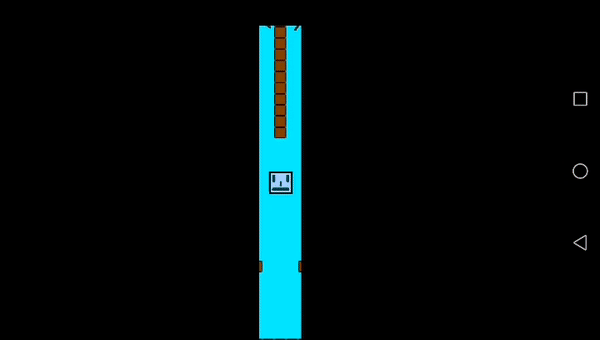
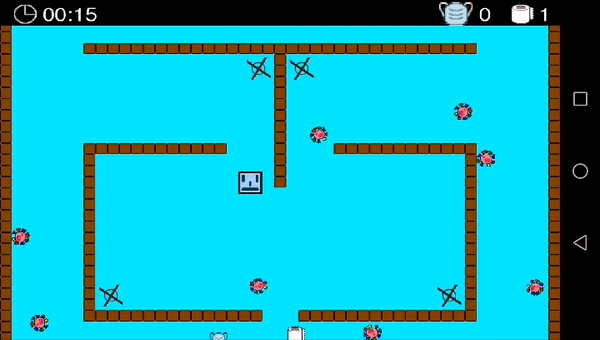
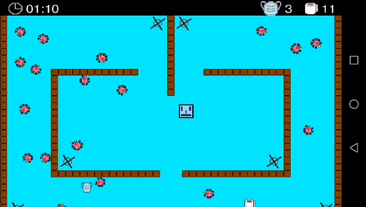
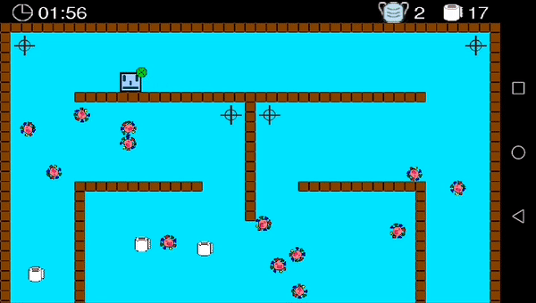

# La Pandemia

- [Introduction](#introduction)
- [Story, goal and rules](#story-goal-and-rules)
- [Installation](#installation)
  - [Make a local clone of the repository and enter it](#make-a-local-clone-of-the-repository-and-enter-it)
  - [Set the ANDROID_SDK_ROOT environment variable](#set-the-android_sdk_root-environment-variable)
  - [Run the assembleDebug task](#run-the-assembledebug-task)

## Introduction
_La Pandemia_ (which translates to English as _The Pandemic_) is a game for Android devices that I've developed as a class project for my _Grado Superior en Desarrollo de Aplicaciones Multiplataforma_ degree, which I took at Colegio Vivas in Spain.

## Story, goal and rules









In _La Pandemia_, a main character is stuck in a user-selected game map where increasingly more _viruses_ appear, moving randomly.  The player has a number of masks that they lose as they come in contact with more and more viruses, until they finally touch a virus without having any masks left, at which point the game is over.

The player gets masks by collecting them from the game map, where more and more also keep appearing periodically in random places. Besides the masks, toilet paper rolls also keep appearing. The goal is to collect as many such rolls as possible until the game ends, and the final score is the total amount of them collected.

I've put together a much more in-depth video presentation where I explain (in Spanish) everything that this game has to offer. It'll soon be uploaded to my school's YouTube channel, and once it's done it'll be added to this document too.

## Installation
The game is currently not available on app markets such as Google Play. Hence, an APK file for the project must be compiled, downloaded into an Android device and run from it in order to play.

To compile the APK file, you must first install an Android SDK with support for API level 14 (for Android 4.0) or newer, and then run the Gradle task ```assembleDebug```.

Below I'll be showing as an example how one would go about doing this on an UNIX environment:

### Make a local clone of the repository and enter it
Naturally, you need to have Git installed on your system.
```
git clone https://github.com/0jc/LaPandemia
cd LaPandemia
```

### Set the ANDROID_SDK_ROOT environment variable
Assuming it's not already done, you must set the ```ANDROID_SDK_ROOT``` environment variable to the root directory path of the Android SDK. The one in the example below is often the correct one, but you may need to set a different one depending on how you installed the SDK.
```
export ANDROID_SDK_ROOT="$HOME/Android/Sdk"
```

### Run the assembleDebug task
From the root directory of the repository, run:
```
./gradlew assembleDebug
```
If the task is successful, the APK file will have been stored on ```./android/build/outputs/apk/debug/android-debug.apk```.
